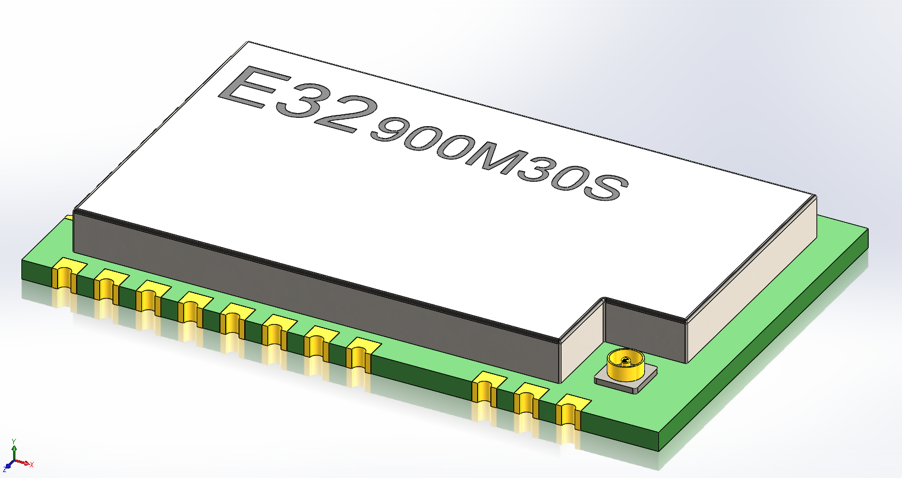

# E32-900M30S Altium Libraries and 3D model

Libraries and model for the Ebyte E32-900M30S LoRa radio transceiver module.

Model is based on [this model for the E22-900M30S module](https://grabcad.com/library/lora-ebyte-e22-900m30s-spi-1w-3d-model-1), which is missing the back row of pins.\
https://grabcad.com/library/lora-ebyte-e22-900m30s-spi-1w-3d-model-1

Model was edited in SolidWorks 2023

